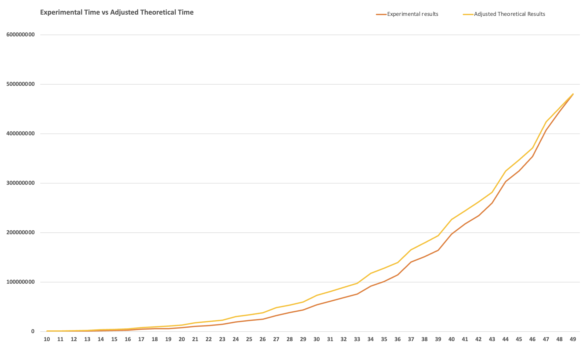

# Project 3

#### Group Members:
1. Vedant Mahangade <br />
2. Miguel Mazumder <br />
3. Ranveer Uppal <br />
4. Gurudeep Machupalli
   
### Problem Statement 5:

A series of client machines [1, 2, … n] are located along a linear network. The i-th client generates the amount of traffic that is given by w[i]. You want to place k servers along the linear network that minimizes the total amount of traffic carried by the network. Total traffic is given by the sum of each client’s individual traffic, multiplied by the distance (the number of hops) from the server. Provide a polynomial time algorithm to identify the optimal locations for k servers.

### Analysis:
Following a dynamic programming approach, we begin by placing a server at the median of a given range of traffic weights. This minimizes cost for the position. Finally, the total cost is calculated based on the server position and is returned. The search for optimal server positions weighs heavily on the time complexity, this requires the following to be calculated; # of clients (n), # of servers (k), and calculating the weights of the traffic. 
As a dynamic programming algorithm, the subsolutions and intermediate subsolutions are stored into a n*n*k table by iterating through # of servers. It works by finding the optimal server positions given different configurations and weights and it measures the time taken for each configuration using time.time_ns() 

### Pseudo Code and Code:
GitHub like: https://github.com/vedantMahangade/CSCI-6212
```python
// Given a k servers and n sized list w of traffic for each client
Algorithm findOptimalServerPosition(w[], n, k)
     create a dp table of size n * n * k
     Initialize dp [i][j][0] = infinity // total cost with zero servers is infinity
     Initialize dp [i][i][1] = 0 //total cost with 1 server and 1 client will be 0

     for m in range(1, k+1):
           for i in range(1, clients+1):
                    for j in range(i, clients+1):
                         for x in range(i, j-1):
                              Find optimal position for i,j clients for 1 server using greedy algo
                              Update dp table with minimum cost with i,j clients
     Backtrack the the dp table to get optimal positions of servers
```
### Time Complexity
The time complexity of this algorithm is based on the following recurrence relation equation:
```math
w(i,j,m) = min\{w(1,x,m-1)+w(x+1,j,1)\}\ ∀\ x\ \{i ≤  x ≤ j-1\}
```
It will recursively consider different possible values for servers in the given range and selecting the combination that minimizes the overall value of w(i, j, m) using median minimization

### Numerical Results

|   N  |   K  | Experimental results (ns) | Theoretical results O(n^3.k) | Scaling Constants | Adjusted Theoretical Results (ns) |
| ---- | ---- | ------------------------- | ---------------------------- | ----------------- | --------------------------------- |
|  10  |   4  |           451750          |               4000           |     272.431989    |             1089727.96            |
|  20  |   6  |          7871000          |              48000           |     272.431989    |             13076735.47           |
|  30  |  10  |         54150083          |             270000           |     272.431989    |             73556637.02           |
|  40  |  13  |        197355958          |             832000           |     272.431989    |            226663414.83           |
|  50  |  16  |        544226000          |            2000000           |     272.431989    |            544863977.96           |

### Data Normalization Notes
We normalized the unitless theoretical values multiplying them by a scaling constant with units milliseconds per theoretical unit. The scaling constant was calculated by the following equation:
```math
 Scaling\ Constant\ = \frac{max(practical)-min(practical)}{max(theoretical)-min(theoretical)}\ =\ 272.431989
```

### Graph



### Graph Observations
From the above graph, our algorithm follows the same time complexity as the scaled theoretical function: O(n3k) as the number of clients and servers increase. There is slight variation in the practical and theoretical times because our practical approach requires indexing through a list of size n*n*k to store the subsolutions of the problem. This adds time that is not accounted for the theoretical time complexity O(n3k). However, by scaling the theoretical, we see that it is still similar.
### Conclusions

In conclusion, the algorithm runs in polynomial time as it needs to determine the best spot for the servers by taking into account the traffic for clients. Strategically placing the servers at the optimal nodes will make for a better network and latency will be mitigated. A real world application for this would be AWS deciding the most optimal areas to place their data centers and networks to provide their customers with appropriate infrastructure for the services AWS offers. Having one server out in California would not be the best for a customer that is trying to spin up an EC2 in Boston, hence they have to place servers closer to that location. The algorithm does not provide the perfect solution, instead provides an optimized solution. For larger numbers of clients and machines, to find the most optimal solution would require a time complexity much larger than O(n3k) due to the nature of this problem. Our dynamic programming algorithm provides a near optimized solution that minimizes the traffic each recursive iteration. It’s not necessarily the best answer, but provides a much more optimal solution compared to any greedy algorithm.
